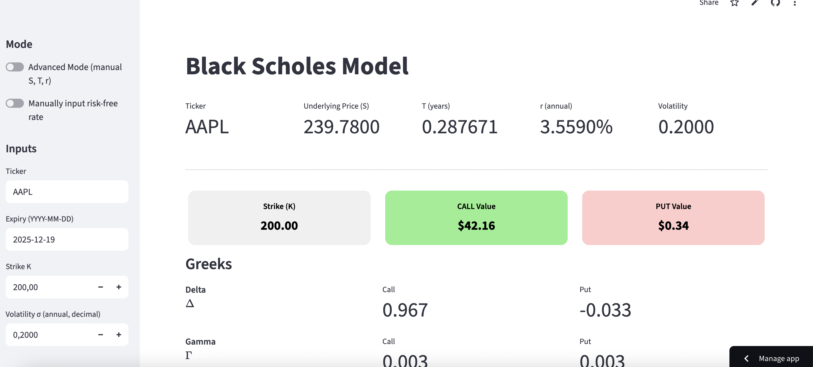
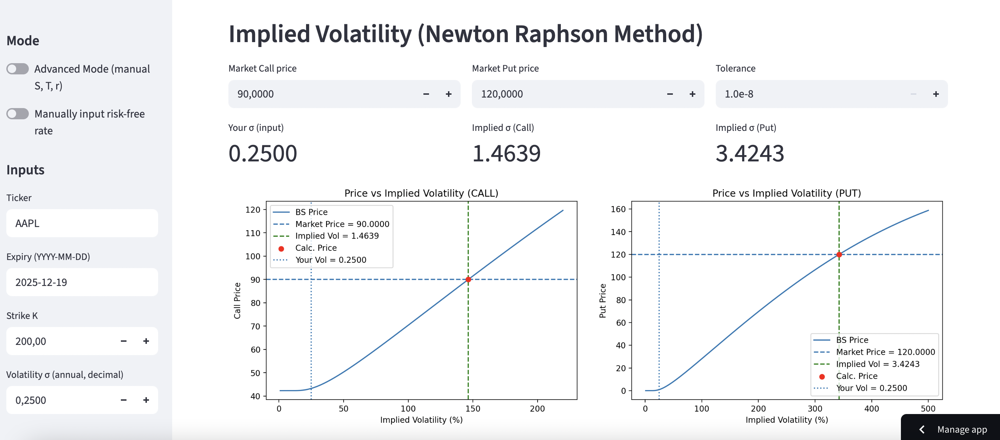

# Black Scholes Model

---

Streamlit dashboard of call and option prices, greeks and implied volatility using Black Scholes Model and Newton Raphson Method with live inputs from Yahoo Finance

## Features

---

- Retrieve live underlying price and risk-free rate from Yahoo Finance by selecting ticker
- Option to manually input underlying price, time and risk-free rate
- Choose strike price and volatility and retrieve call value, put value and greeks


- Choose market price and tolerance
- Calculate implied volatility and compare with your volatility

## Demo

---

Try out the demo at: https://nfalckblackscholesmodel.streamlit.app/


## Run Locally

---

1. **Clone the Repository**: 
   - Open your terminal or command prompt.
   - Navigate to the directory where you want to clone the repository.
   - Run the following command:
     ```shell
     git clone https://github.com/nfalck/BlackScholesModel.git
     ```
     
2. **Install Dependencies**: 
   - You need to install streamlit, yfinance, numpy, matplotlib and scipy.
   - Install them separately or run the following command:
     ```shell
     pip install -r requirements.txt
     ```
     
2. **Run the Application**: 
   - Execute the following command to run the streamlit app:
     ```shell
     streamlit run main.py
     ```

## Resources

---

- [Code for Newton Raphson Method by QuantPy](https://www.youtube.com/watch?v=mPgVeazeq5U)
- Options, Futures and Other Derivatives by Hull and Basu