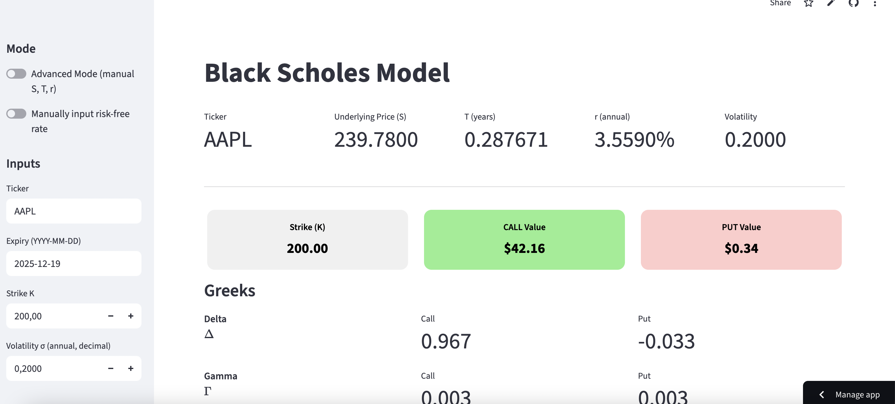
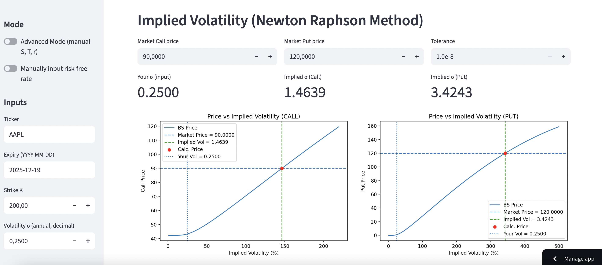
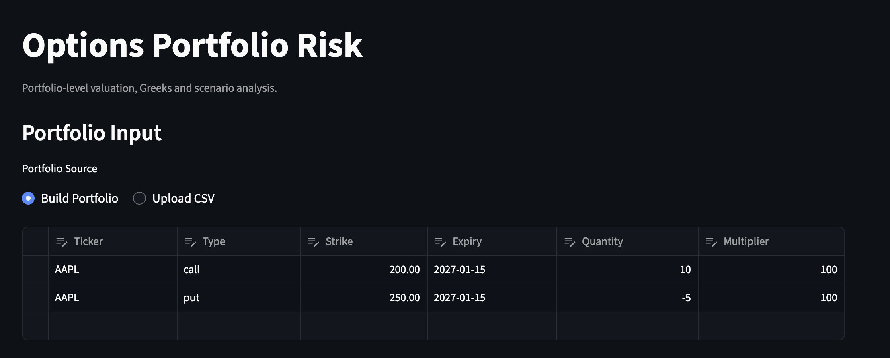
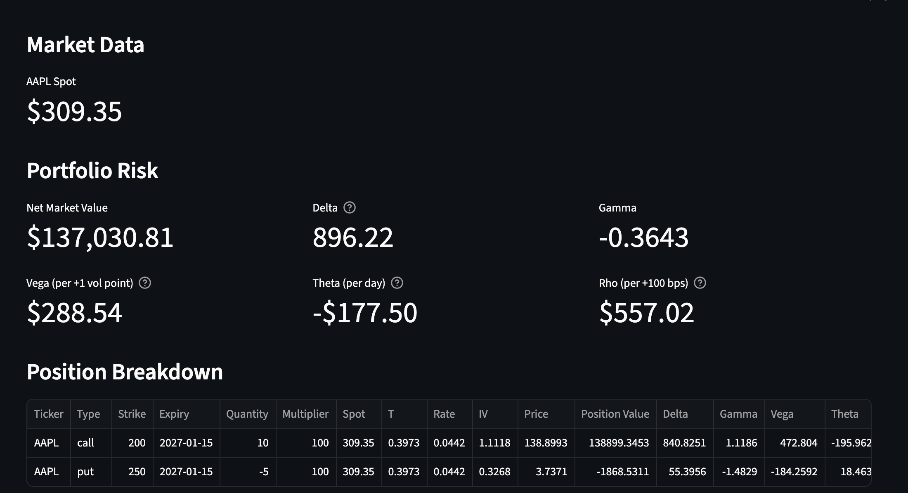
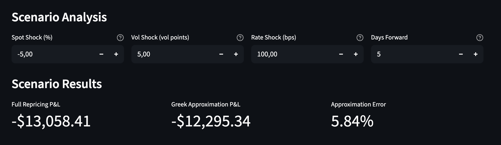
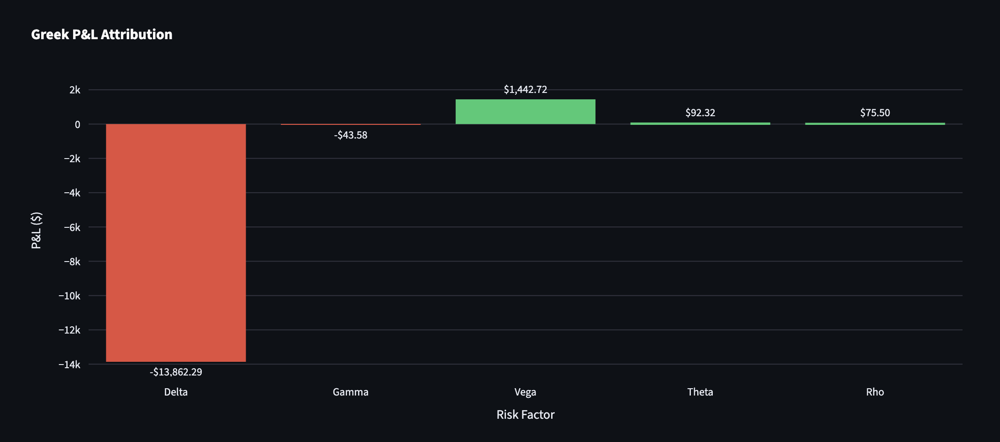
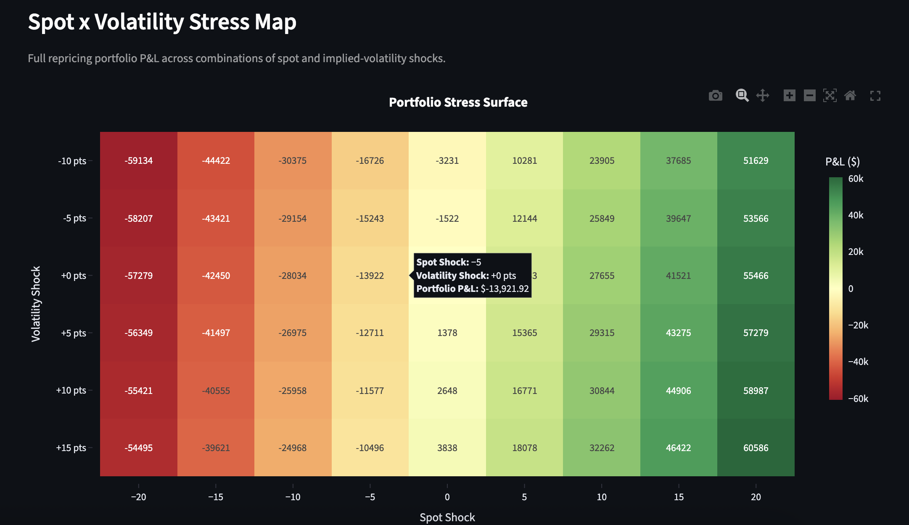
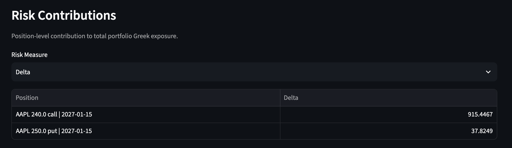
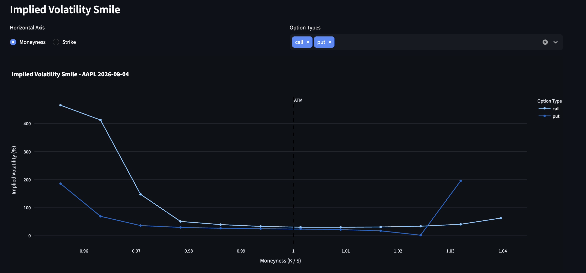

# Black Scholes Options Risk Dashboard


A Streamlit application for option pricing, Greeks, implied volatility, volatility smiles and skews, and portfolio-level risk analysis using the Black Scholes model. The project combines live market data with scenario analysis and full portfolio repricing.
## Features

### Black Scholes Pricing


- Retrieve live underlying price and risk-free rate from Yahoo Finance by selecting ticker
- Option to manually input underlying price, time and risk-free rate
- Choose strike price and volatility and retrieve call value, put value and greeks


### Implied Volatility Solver

- Choose market price and tolerance
- Calculate implied volatility through Newton-Raphson method and compare with your volatility

### Portfolio Builder

- Upload an options portfolio from CSV or create the portfolio directly with the builder
- Retrieve live spot prices for the underlying assets
- Use maturity specific risk-free rates
- Derive contract specific implied volatility from live option chain prices

### Portfolio Risk

- Calculate portfolio market value and aggregate Delta, Gamma, Vega, Theta and Rho
- Display a position-level breakdown of prices, market inputs, values and Greeks

### Scenario Analysis

- Apply spot, volatility, interest rate and time-forward stress scenarios
- Compare Greek P&L approximation with full Black Scholes repricing

### Greek P&L Attribution

- Break approximate scenario P&L into Delta, Gamma, Vega, Theta and Rho contributions

### Spot x Volatility Heatmap

- Visualize scenario exposure with an interactive Spot x Volatility P&L heatmap

### Position Risk Contributions

- Analzye which individual option positions contribute most to portfolio (including the Greeks)

### Volatility Analysis

- Retrieve available option expiration dates for a selected ticker
- Load live option chain bid and ask quotes from Yahoo Finance
- Derive contract-level implied volatility using Newton-Raphson
- Filter option chains by bid-ask spread and minimum open interest
- Visualize the implied-volatility smile across moneyness
- Compare call and put implied volatility across strikes

**Market data note:** Option-chain analysis depends on the availability and quality
of market quotes. Bid/ask data may be stale, zero, or unavailable outside the relevant exchange's
trading hours, particularly for less liquid contracts.

## Planned Improvements
- Add continuous dividend yield to the Black Scholes model
- Add additional volatility surface analysis
- Improve handling of stale and illiquid option chain quotes
- Home page explaining the dashboard pages
- Incorporate pytests for model validation

## Current Model Limitations
This project is intended as a quantitative finance and risk analysis project, not as a production trading or valuation system.

Current limitations include:
- European-style Black Scholes pricing assumptions
- No dividend yield parameter is currently included
- Option chain quotes can be stale or unavailable outside market hours
- Implied volatility may not be recoverable for illiquid contracts or invalid bid/ask quotes
- Transaction costs, slippage and liquidity effects are not modelled
- Black Scholes assumes constant volatility and interest rates over the option's life

## Demo


Try out the demo at: https://nfalckblackscholesmodel.streamlit.app/


## Run Locally


1. **Clone the Repository**: 
   - Open your terminal or command prompt.
   - Navigate to the directory where you want to clone the repository.
   - Run the following command:
     ```shell
     git clone https://github.com/nfalck/BlackScholesModel.git
     ```
     
2. **Install Dependencies**: 
   - You need to install streamlit, yfinance, numpy, matplotlib, scipy and plotly.
   - Install them separately or run the following command:
     ```shell
     pip install -r requirements.txt
     ```
     
2. **Run the Application**: 
   - Execute the following command to run the streamlit app:
     ```shell
     streamlit run 1_Options_Pricing.py
     ```

## Resources


- [Code for Newton Raphson Method by QuantPy](https://www.youtube.com/watch?v=mPgVeazeq5U)
- Options, Futures and Other Derivatives by Hull and Basu